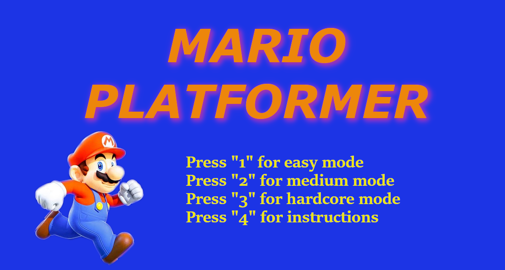
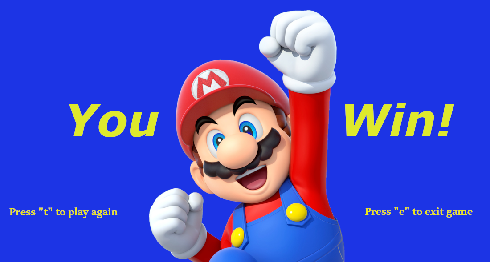

# Mario Platformer
A Super Mario platformer game using the Greenfoot Mario Platformer! 

## Description
Mario Platformer is a remake of the classic and beloved Super Mario franchise! The player Mario travels across multiple jam-packed levels, moving and avoiding enemies to beat the game. The game contains different types of enemies, platforms, and backgrounds for a fulfilling experience. The user interface is very well designed with different screens for simple and concise navigation. Read the tutorial to learn more about the game and how it works. Quench your nostalgia and play the Mario Platformer today! No matter how many times you play, you definitely won't regret it! 

## How to Run

1. Download [Greenfoot](https://www.greenfoot.org/download).
2. Download [MarioPlatformer.gfar](MarioPlatformer.gfar) and open it.
3. Click *Run* to play the game! 

**OR**

1. Download [Greenfoot](https://www.greenfoot.org/download).
2. Download the zip file of the repository (on the top right, click the download icon, and choose zip format) and extract it.
3. Open the greenfoot project file to run the program. 

## How the Game Works
Check out the [Flowchart](Documentation/Flowchart.pdf), [API](Documentation/API.pdf), and [Class Diagram](Documentation/ClassDiagram.pdf) to learn more!

### Credits
**Graphics:** Super Mario Bros, Google Images, GIMP 2.10

**Music:** Super Mario, soundcloud.com, themushroomkingdom.net/media
